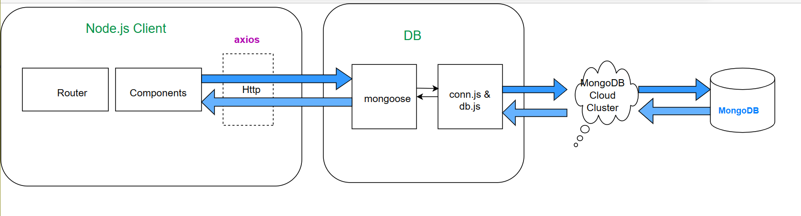

# TravelSomeWhere using HTML, CSS, JavaScript, Node.js and MongoDB

# project-documentation

  

<h3 align="center">Home Page</h3>

---

 In my project, I had implemented the javascript, HTML, CSS, Node.js and MongoDB in the name of "TravelSomeWhere". This is a travel website that provides information on various destinations around the world. Users can search for destinations, view details about the location and plan their trip accordingly. Main Purpose of this project is to Plan a trip by selecting a destination and choosing from various travel options such as foods, maps, myths and activities. 
      

## 📝 Table of Contents
- [About](#about)
- [Getting Started](#getting_started)
- [Deployment](#deployment)
- [Usage](#usage)
- [Flow Chart](#flowchart)
- [TODO](../TODO.md)
- [Contributing](../CONTRIBUTING.md)
- [Authors](#authors)
- [Acknowledgments](#acknowledgement)

## 🧐 About 
Home Page of TravelSomeWhere is a responsive website. The technologies used in this project are HTML, CSS, JavaScript, MongoDB and cluster. There are a few important modules in the project like home page, login and registration, finding the tourist places, map and foods facilities. I took almost 40 - 50 hrs to complete this project. SkillLync helped me by providing the wire-frames for all relevant features.

## 🏁 Getting Started 
These instructions will get you a copy of the project up and running on your local machine for development and testing purposes.
1. Clone the repository and navigate to the root directory.
2. Install the required dependencies required for the Project using Javascript by running npm install.
3. Configure the database connection by modifying conn.js and db.js with your database information using mongoose using the mongoDB cloud cluster.
4. Start the project by running npm run dev.
5. Open your web browser and navigate to http://localhost:3000 to view the application.

 See [deployment](#deployment) for notes on how to deploy the project on a live system.

### Prerequisites

we have to install 

Visual Studio,
MongoDB Compass,
react-google-login, 
bcryptis, 
express, 
express handebars, 
hbs, 
axios, 
mongoose

### Installing
A step by step series of examples that tell you how to get a development env running.

Back-End:

https://www.mongodb.com/try/download/compass

Front-End:

npm init 

npm install

npm install axios

npm install express

npm install bcryptjs

npm install body-parser

npm install connect-flash

npm install express-handlebars

npm install express-session

npm install express-validator

npm install hbs

npm install mongoose

npm install nodeman

## 🔧 Running the tests 

Running the project using the following commands:

1. By typing "npm run dev" or "npm start" for nodejs in Front-End

2. By connecting the MongoDB Compass connection using MongoDB Cloud Cluster 

### Break down into end to end tests
End-to-end tests are designed to test the complete flow of the application from the user's perspective so it's important to think about the different user actions and interactions that need to be tested. 

1. User authentication: Test the user authentication flow, including logging in with valid and invalid credentials, session management, and logout functionality using the NextAuth(Google authentication).

2. User profile: Test the user profile functionality, including editing user information, searching tourist places, and viewing tourist profiles along with food and maps.

3. Search functionality: Test the ability to search for tourist places, maps, contact us and foods content within the application.

4. Integration with external APIs: Test any integrations with external APIs for travel website.

By testing the application end-to-end, the entire application is functioning as expected and that users can successfully complete the tasks.

## 🎈 Usage 
1. Installation: Need to install all the supporting dependencies as mentioned in installing topic.

2. Configuration: Configure the database connection by modifying conn.js and db.js with your database information.

3. Usage instructions: Start the front end using npm run dev or npm start, give the login access by registering the TravelSomeWhere. After successful login, we can search the tourist, places uing search box and give feedback about website.

4. API documentation: REST APIs communicate via HTTP requests to perform standard database functions inserting, reading, updating, and deleting records (also known as CRUD) within a resource. All HTTP methods can be used in API calls. A well-designed REST API is similar to a website running in a web browser with built-in HTTP functionality.

5. Limitations: As it is travel website project, users can able to search the tourist place or see the locations and food items when using the application. This can include known bugs or issues, performance limitations, or any specific use cases that the application or library may not support.

6. Troubleshooting: Once successfully login only allowed to view the detailled information, user can't see from the client side without registering the website. It will throw alert box to login to proceed further.

## 🚀 Deployment 
To deploy the application to a production environment, follow these steps:

1. Ensure that you have installed the required dependencies and have configured the necessary environment variables, such as the database connection details.

2. Start the application by running "npm run dev" for the frontend.

3. Copy the built application to the server or hosting environment where you want to deploy the application.

4. Application is accessible from the internet by configuring http://loclhost:3000.

5. Monitor the application for any errors or issues, and make any necessary updates or patches as needed.

## ⛏ Flow Chart 

- [MongoDB Compass](https://www.mongodb.com/) - Database
- [Express](https://expressjs.com/) - Server Framework
- [NodeJs](https://nodejs.org/) - Web Framework
- [MogoDB Cloud Cluster](https://cloud.mongodb.com/v2/6446526b3b5cb434d40d4dd9#/clusters) - Server Environment

## ✍️ Authors 
- [@SkillLymc](https://github.com/kylelobo) - FSD

See also the list of [contributors](https://github.com/kylelobo/The-Documentation-Compendium/contributors) who participated in this project.

## 🎉 Acknowledgements 
I would like to thank the following individuals for their contributions to this project:

- The team at Skill-Lync, for generously providing the data used in this project. 

  Without their contributions, this project would not have been possible.
- References:
https://www.mongodb.com/cloud/atlas/lp/try4?utm_source=bing&utm_campaign=search_bs_pl_evergreen_atlas_core_prosp-brand_gic-null_apac-in_ps-all_desktop_eng_lead&utm_term=cloud%20mongodb&utm_medium=cpc_paid_search&utm_ad=p&utm_ad_campaign_id=415204524&adgroup=1222657400083518&msclkid=7318cb68f0891289e32aaf3882e74b08

